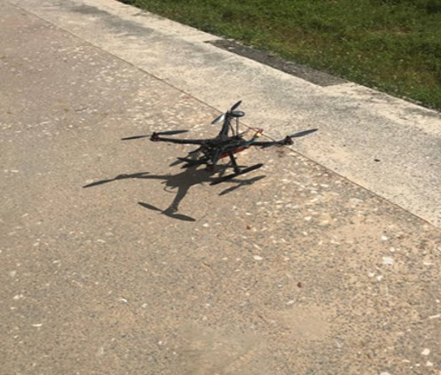

# Bankai — Quadcopter Build and Flight

A fully assembled and flight-tested quadcopter built from individual components during a robotics engineering internship at Setscentral Ltd., Yola, Nigeria, in 2022.
Over roughly four weeks of testing (four sessions a week, at least three hours per session), the team took turns piloting Bankai in flights of ten-plus minutes each, eventually achieving stable controlled flight at altitudes exceeding a two-storey building. The flight controller was fully calibrated within four attempts, aided by prior simulated flight training in RealFlight.

## Overview

Bankai was a quadcopter assembled as part of a robotics engineering internship. The project provided practical experience with UAV components, mechanical assembly, electronic integration, flight-controller configuration, calibration, battery management, simulation, and flight testing.

The objective was to understand how the major subsystems of a quadcopter work together to produce controlled and stable flight.

The project progressed from learning basic drone flight in a desktop simulator to assembling and calibrating the physical aircraft and ultimately flying it.

---

## Drone Flight Simulation

Before operating the physical quadcopter, I used the RealFlight drone simulator to develop familiarity with basic drone flight and transmitter controls.

I practised using obstacle courses in the simulation environment. This provided a low-risk way to develop basic flight control skills and understand the behaviour of a quadcopter before progressing to physical flight.

The experience helped me develop an initial understanding of drone flight dynamics and laid the foundation for subsequent physical flight testing of Bankai.

---

## Quadcopter Design

The Bankai quadcopter consisted of four major subsystems:

1. **Propulsion system** — motors, propellers and electronic speed controllers (ESCs)
2. **Flight control system** — flight controller and onboard sensors
3. **Auxiliary systems** — GPS and compass
4. **Payload system** — components added to perform the intended application of the drone

### Components

| Component | Specification |
|---|---|
| Frame | HolyBro S500 480 mm Quadcopter |
| Motors | 2212 920KV CW/CCW Brushless Motors |
| Propellers | 1045 Propellers |
| Electronic Speed Controllers | 30A 3–4S ESC ×4 |
| Flight Controller | Pixhawk 2.4.8 32-bit |
| Radio System | FLYSKY Transmitter with IA6B Receiver |
| Battery | LiPo 5200mAh 11.1V 60C with XT60 Plug |
| GPS | M8N GPS Module with Compass |
| Ground Control Software | Mission Planner |
| Flight Simulator | RealFlight Drone Simulator |

---

## System Components

### HolyBro S500 Frame

The HolyBro S500 provided the main frame and arms for the quadcopter. The frame and arms were coupled using fasteners.

### Brushless Motors and Propellers

Four 2212 920KV brushless motors were mounted to the arms using bolts and nuts.

The motors were arranged using clockwise (CW) and counter-clockwise (CCW) configurations. The propellers were attached to the motors and provided the lift required for flight.

### Electronic Speed Controllers

Four 30A 3–4S electronic speed controllers were connected to the corresponding motors.

The ESC connections were soldered to the power distribution board, with positive and negative connections correctly matched. Continuity testing was performed after the soldering process to verify the electrical connections before powering the system.

### Pixhawk Flight Controller

The Pixhawk 2.4.8 32-bit flight controller served as the central control unit of the quadcopter.

The flight controller was connected to the ESCs, radio receiver, GPS module, power module and safety switch through their respective ports.

### Radio System

A FLYSKY transmitter with an IA6B receiver was used to provide radio control input to the flight controller.

### GPS and Compass

An M8N GPS module with compass was integrated with the flight controller to provide geographical positioning information.

### Power Module and LiPo Battery

The power module connected to the flight controller and provided power from the LiPo battery while also enabling monitoring of battery voltage and current consumption.

The quadcopter used a 5200mAh, 11.1V, 60C three-cell LiPo battery with an XT60 connector.

The battery was charged using a B6 V3 Smart Charger, with attention given to balancing the three cells before use.

---

## Build and Integration

The physical construction involved integrating the mechanical, electrical, and control components of the quadcopter.

### Mechanical Assembly

The HolyBro S500 frame and arms were assembled using fasteners.

The four brushless motors were mounted on the arms with bolts and nuts, with attention to motor orientation.

### Electrical Integration

Each ESC was connected to its corresponding motor.

The ESCs were then connected to the power distribution board through soldered positive and negative connections.

Continuity testing was performed on the connections before proceeding with powered testing.

### Flight Controller Integration

The Pixhawk flight controller was connected to:

- ESC motor channels
- FLYSKY IA6B receiver
- M8N GPS and compass
- Power module
- Safety switch

This integration allowed the flight controller to receive control inputs and sensor information while controlling the propulsion system.

---

## Calibration

The quadcopter was calibrated using Mission Planner, a ground control software used for configuring and preparing the flight controller.

The calibration process included:

- Accelerometer calibration
- Compass calibration
- Radio transmitter calibration
- Channel mapping and endpoint verification
- Motor direction verification
- ESC calibration

Multiple attempts were required during the calibration process before all sensors were successfully calibrated.

---

## Battery Management and Safety

The Bankai quadcopter used a three-cell LiPo battery.

The battery was charged using a B6 V3 Smart Charger, with the cells charged evenly before use.

Safety precautions were also taken during flight testing. In particular, propeller tightness was checked before flights to reduce the risk of mechanical failure during operation.

---

## Flight Testing

Following assembly and calibration, Bankai was successfully flown.

The project progressed from simulated flight training using RealFlight to physical calibration and controlled flight testing of the completed quadcopter.

The completed system demonstrated the integration of mechanical, electrical, power, communication, navigation, and flight-control components into a functioning UAV.

---

## Challenges and Solutions

### Understanding Motor Direction

One of the initial challenges was understanding the arrangement of clockwise and counter-clockwise motors and how their configuration contributes to yaw stability.

This was resolved through further study of quadcopter propulsion principles and review of the HolyBro S500 documentation.

### ESC Soldering

Making clean electrical connections between the ESCs and the power distribution board required careful soldering.

Continuity testing was performed after each connection to identify potential electrical issues before powering the system.

### Mission Planner Calibration

The calibration sequence required following specific procedures and physically orienting the aircraft correctly during sensor calibration.

Multiple attempts were required before the calibration process was completed.

---

## What I Learned

The project gave me practical experience in:

- Understanding the function of individual UAV components
- Assembling a quadcopter from individual components
- Integrating motors, ESCs, power distribution, and flight-control systems
- Soldering electrical connections
- Performing continuity testing
- Configuring and calibrating a Pixhawk flight controller
- Using Mission Planner
- Configuring a radio transmitter and receiver
- Charging and handling a three-cell LiPo battery
- Using flight simulation to develop basic drone-piloting skills
- Piloting a physical quadcopter
- Applying basic pre-flight safety procedures
- Understanding the interaction between different UAV subsystems

---

## Engineering Reflection

Building Bankai gave me a practical understanding of how individual engineering components become a functioning system.

Rather than studying motors, sensors, controllers, and power systems independently, I had to understand how they interacted within one physical platform. The project reinforced the importance of system integration, careful testing, and troubleshooting in engineering.

The progression from simulation to physical assembly, calibration, and flight also showed me the value of learning through building and experimentation.

---

## What I Would Do Differently

If I were to repeat the project, I would consider:

- Adding a current sensor from the beginning for more detailed power monitoring
- Using vibration damping for the flight controller to reduce potential IMU noise
- Performing ESC calibration individually before connecting the complete system

---

## Skills Demonstrated

- UAV mechanical assembly
- Electronic integration
- Soldering and continuity testing
- Flight controller configuration
- Mission Planner
- Radio transmitter configuration
- LiPo battery management
- Drone piloting
- UAV systems thinking
- Hardware troubleshooting
- Component-level engineering

---

## Project Context

**Organisation:** Setscentral Ltd.  
**Location:** Karewa, Jimeta-Yola, Adamawa State, Nigeria  
**Internship:** Robotics Engineering Internship  
**Period:** September–November 2022

The project was completed as part of a robotics engineering internship focused on practical exposure to robotics, electronics, automation and autonomous systems.

---

## Repository Structure

```text
bankai-quadcopter/
│
├── README.md
│
└── images/
│   ├── Bankai_Quadopter.jpg
│   ├── Bankai_with_its_creators.jpg
│   ├── HolyBro S500 480 mm.jpg
│   ├── M8N GPS + brushless motors.jpg
│   ├── bankai_in_making.jpg
│   ├── propellers.jpg
│   └── README.md
│
└── references/
    └── component_datasheets.md
